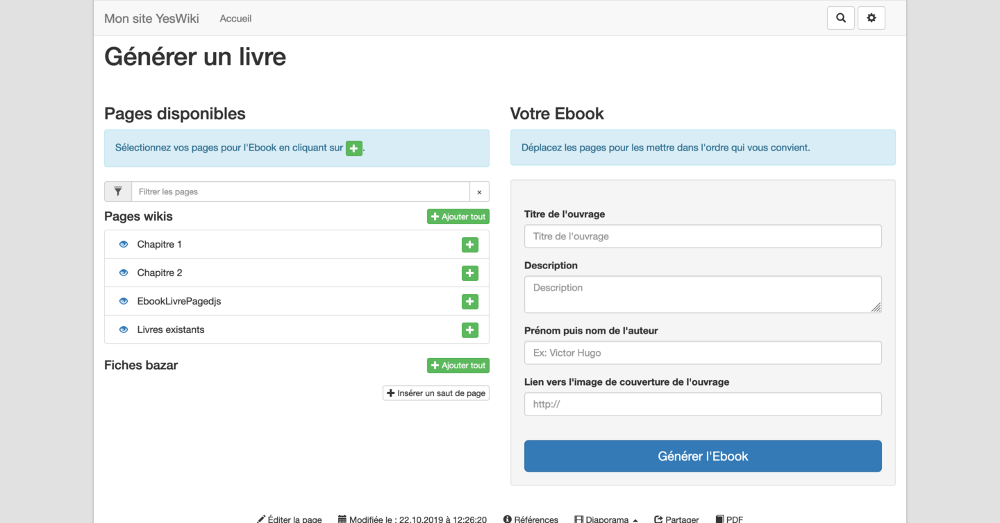
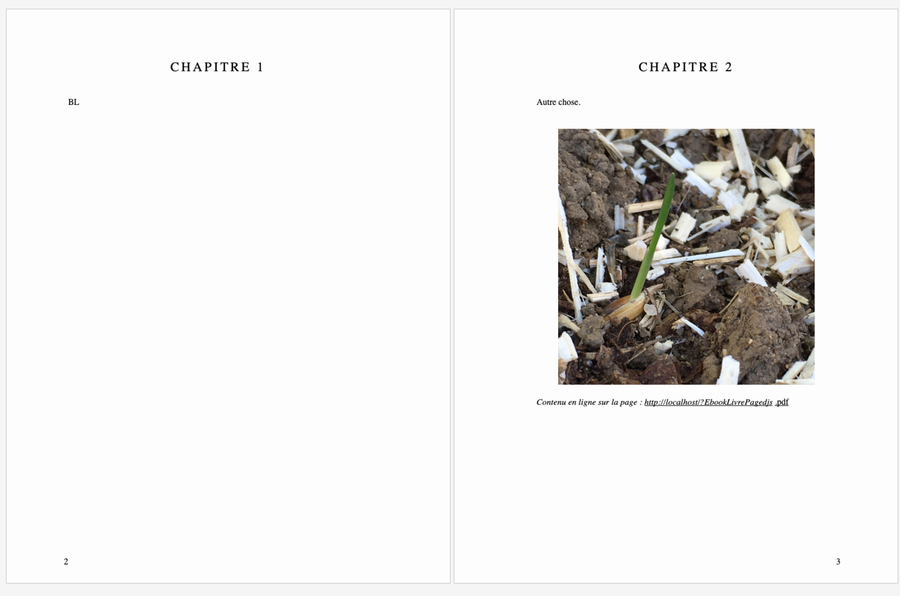

# Extension YesWiki publication

> Attention — Ceci est une extension de YesWiki. Elle ne fait pas partie du cœur officiellement maintenu de YesWiki.

Cette extension permet de générer des publications aux formats epub et PDF à partir d'une sélection de fiches bazar ou de pages YesWiki.

Les publications générées peuvent être de type :

- ebook
- newsletter

La mise en page est effectuée par [Paged.js](https://gitlab.pagedmedia.org/tools/pagedjs)
([fonctionnement](https://www.pagedmedia.org/paged-js/)).

<table>
  <tr>
    <td>
      
    </td>
    <td>
      
    </td>
  </tr>
  <tr>
    <th scope="col">Assemblage des pages wiki pour constituer un ouvrage</th>
    <th scope="col">Prévisualisaton avant téléchargement</th>
  </tr>
</table>

## Pré-requis

Avoir installé [Chromium](https://www.chromium.org/Home) **sur
le serveur** et connaitre le chemin d'accès vers l'exécutable.

Pour installer Chrome sous Ubuntu/Debian :

```bash
sudo apt install -y --no-install-recommends chromium
```

## Fonctionnement général

La génération d'une publication se fait en plusieurs étapes.

1. Sélection des éléments constitutifs de la publication.
2. Organisation des éléments constitutifs au sein de la publication.
3. Génération et enregistrement de la publication.
4. Production du PDF ou de l'ePub.

L'action `{{publicationgenerator}}` prend en charge les étapes 1, 2 et 3.

Le handler `/pdf` prend en charge la production du PDF.

### Pour générer des ebooks

Utiliser l'action `{{publicationgenerator}}`. Aucun paramètre n'est obligatoire.

Chaque ebook généré sera enregistré sous la forme d'une page sur le wiki. Le nom de cette page sera constitué de la valeur du paramètre `ebookpagenameprefix` suivie du titre de l'ebook.

On pourra utilement consulter la section "Action `{{publicationgenerator}}`" ci-après.

## Pour générer des newsletters

Avant de pouvoir générer des newsletters, il faut créer un formulaire bazar suivant avec la structure suivante :

```
texte***bf_titre***Titre***60***255*** *** *** ***1***0***
texte***bf_description***Description***60***255*** *** *** ***0***0***
texte***bf_author***Auteur***60***255*** *** *** ***0***0***
textelong***bf_content***Contenu de la newsletter***20***20*** *** ***html***1***0***
```

Un fois ce formulaire créé, il faut trouver son id et utiliser l'action `{{publicationgenerator}}` avec, au minimum les paramètres suivants :

- `outputformat="newsletter"`
- `formid="<id du formulaire>"`

Soit, au minimum : `{{publicationgenerator outputformat="newsletter" formid="<id du formulaire>"}}`

Chaque newsletter générée sera enregistrée sous la forme d'une fiche bazar du formulaire \<id du formulaire> sur le wiki.

On pourra utilement consulter la section "Action `{{publicationgenerator}}`" ci-après.

## Actions YesWiki

L'extension publication ajoute deux actions à votre wiki.

| Action                    | Utilité                                       |
| ---                       | ---                                           |
| `{{publicationgenerator}}`| Interface de sélection du contenu de la publication et de création du document imprimable  |
| `{{ebooklist}}`           | Liste des ebooks générés et imprimables               |
Ces actions s'ajoutent, comme toute action YesWiki, dans un contenu de page.

### Action `{{publicationgenerator}}`

Cette action affiche une interface permettant de

- sélectionner, parmi les fiches bazar et pages YesWiki, les éléments constituant la publication ;
- organiser ces différents éléments au sein de la publication ;
- créer le document imprimable résultant.

Les différents paramètres de cette action sont les suivants.

*N.B* — Dans les explications qui suivent, le terme "sélection" désigne la sélection des éléments constitutifs d'une publication.

#### **outputformat**

Détermine le type de publication générée (ebook ou newsletter).

S'il n'est pas précisé, ce paramètre vaut "ebook".

Exemple – pour générer une newsletter il faut donc écrire :

```
{{publicationgenerator outputformat="newsletter"}}
```

#### **formid**

*Paramètre obligatoire dans le cas où on souhaite générer une newsletter.*

Lorsqu'une newsletter est générée, elle est enregistrée sous forme d'une fiche bazar (voir à cet effet la section "Pour générer des newsletters"). Ce paramètre permet de spécifier le numéro identifiant du formulaire bazar en question.

Exemple – pour générer une newsletter avec le formulaire bazar "2", il faut donc écrire :

```
{{publicationgenerator outputformat="newsletter" formid="2"}}
```

#### **publicationstart**

Nom de la page à utiliser comme page d'introduction de la publication.

Exemple :

```
{{publicationgenerator publicationstart="MaPageWiki"}}
```

#### **publicationend**

Nom de la page à utiliser comme page de fin de la publication.

Exemple :

```
{{publicationgenerator publicationend="MaPageWiki"}}
```

#### **ebookpagenameprefix**

*Paramètre utilisé uniquement dans le cas d'un ebook.*

Lorsqu'un ebook est généré, il est enregistré sous forme d'une page YesWiki (voir à cet effet la section "Pour générer des ebooks"). Ce paramètre permet de spécifier le préfixe automatiquement ajouté en début du nom de la page ainsi créée.

S'il n'est pas précisé, ce paramètre vaut "Ebook".

Exemple – pour générer un ebook avec le préfixe "MesEDoc", il faut donc écrire :

```
{{publicationgenerator outputformat="ebook" ebookpagenameprefix="MesEDoc"}}
```


#### **addinstalledpage**

Si ce paramètre n'est pas présent, lors de la sélection, on ne propose pas les pages créées par défaut lors de l'installation de YesWiki.
>**ATTENTION — Le `code` ne me semble pas clair du tout sur ce paramètre**


#### **coverimage**

*Paramètre utilisé uniquement dans le cas d'un ebook.*

Image de couverture utilisée par défaut en 1re page de couverture des ebooks générés.

Cette image sera proposée par défaut lors de la sélection. Elle peut alors être remplacée par une différente pour chaque publication.

Exemple  :

```
{{publicationgenerator outputformat="ebook" coverimage="monImage.jpg"}}
```

#### **title**

Titre par défaut des publications à générer.

Ce titre sera proposé par défaut lors de la sélection. Il peut alors être remplacé par un différent pour chaque publication.

Exemple  :

```
{{publicationgenerator title="Guerre et paix"}}
```

#### **desc**

Description par défaut des publications générées.

Cette description sera proposée par défaut lors de la sélection. Elle peut alors être remplacée par une différente pour chaque publication.

Exemple  :

```
{{publicationgenerator desc="Les nouveautés du mois dernier"}}
```

#### **author**

Auteur par défaut des publications à générer.

Cet auteur sera proposé par défaut lors de la sélection. Il peut alors être remplacé par un différent pour chaque publication.

Exemple  :

```
{{publicationgenerator title="George Sand"}}
```

#### **chapterpages**

Liste des noms des pages YesWiki à utiliser par défaut au début de chaque chapitre des publications à générer.

Dans la liste, les noms doivent être séparés par des virgules.

Ces pages seront proposées par défaut lors de la sélection. Elles pourront alors être remplacées.

Exemple  :

```
{{publicationgenerator chapterpages="DebutChapitreUn, DebutChapitreDeux, DebutChapitreTrois"}}
```

#### **template**

Spécifie le template utilisé pour afficher l'interface de sélection.

Pour le moment, le seul qui existe est `exportpages_table.tpl.html`.

S'il n'est pas précisé, ce paramètre vaut "exportpages_table.tpl.html".

Exemple  :
```
{{publicationgenerator template="exportpages_table.tpl.html"}}
```

#### **titles**

*S'il est utilisé, ce paramètre doit l'être conjointement au paramètre `id`.*

Liste des noms des groupes dans lesquels seront proposés les éléments (fiches bazar ou pages) lors de la sélection.

Dans la liste, les noms doivent être séparés par des virgules.

#### **id**

*S'il est utilisé, ce paramètre doit l'être conjointement au paramètre `titles`.*

Liste des groupes d'éléments proposés à la sélection.

Dans la liste,

- les groupes doivent être séparés par des virgules ;
- les pages YesWiki seront identifiées par le mot "pages" ;
- un formulaire bazar est identifié par son numéro identifiant (exemple : "1") ;
  pour un formulaire, on peut préciser, entre parenthèses et après son numéro,
  - une liste de critères de sélection dans ce formulaire ,
  - les critères doivent être séparés par des "|".

Exemple – Pour organiser les éléments proposés dans trois groupes,

- un groupe, nommé "pages wiki", reprenant les pages du wiki ;
- un groupe, nommé "recettes de cuisine", reprenant les fiches du formulaire 1 ;
- un groupe, nommé "livres", reprenant les fiches du formulaire 2 dont l'auteur est "Rabelais" ou dont la taille est "long" ;

on écrira :

```
{{publicationgenerator titles="pages wiki, recettes de cuisine, livres" id="pages, 1, 2(bf_auteur=Rabelais|bf_taille=long)"}}
```

### Action `{{ebooklist}}`

Cette action liste les ebook générés.

#### **ebookpagenameprefix**

Le paramètre `ebookpagenameprefix` permet de préciser le préfixe par lequel commencent les noms de pages correspondant à des ebook.

S'il n'est pas précisé, ce paramètre vaut "Ebook".

Exemple – Pour lister les ebooks dont le préfixe est "MesEDoc", il faut donc écrire :

```
{{ebooklist outputformat="ebook" ebookpagenameprefix="MesEDoc"}}
```

## Handlers (ou suffixes) de page

L'extension publication ajoute deux handlers aux pages de votre wiki.

| handler       | Utilité                        |
| ---           | ---                            |
| `/pdf`        | Télécharge un document en PDF  |
| `/preview`    | Prévisualise un document |

## Configuration

Le fichier de configuration [`wakka.config.php`][wakka-config] accepte
plusieurs paramètres pour ajuster le rendu PDF à votre infrastructure informatique.

| Clé de configuration | Valeur par défaut                  | Utilité
| ---                  | ---                                | ---
| `htmltopdf_path`     | `/usr/bin/chromium`                | Indique l'emplacement du programme chargé
| `htmltopdf_options`  | ['windowSize' => ['1440', '780']]  | Options par défaut passées au navigateur embarqué
| `htmltopdf_url`      |                                    | Adresse du serveur YesWiki qui fera le rendu à distance
| `htmltopdf_key`      |                                    | Clé du serveur qui autorise ce wiki à générer des pdf
| `htmltopdf_apikey`   |                                    | A METTRE SUR UN SERVEUR QUI PARTAGE LES FONCTIONS DE GENERATEUR DE PDF défini le mot de passe pour la clé pour les autres wikis

### … avec Chrome/Firefox sur votre serveur

```php
array(
    ...
    'htmltopdf_path' => '/usr/bin/chromium',
    'htmltopdf_options' => ['windowSize' => ['1440', '780'], 'noSandbox' => true],
    ...
);
```

### Vous avez un YesWiki paramétré avec le module `yeswiki-extension-publication`

```php
array(
    ...
    'htmltopdf_url' => 'https://example.org/yeswiki/?PagePrincipale/pdf',
    'htmltopdf_key' => 'motdepasseConfiguré',
    ...
);
```
