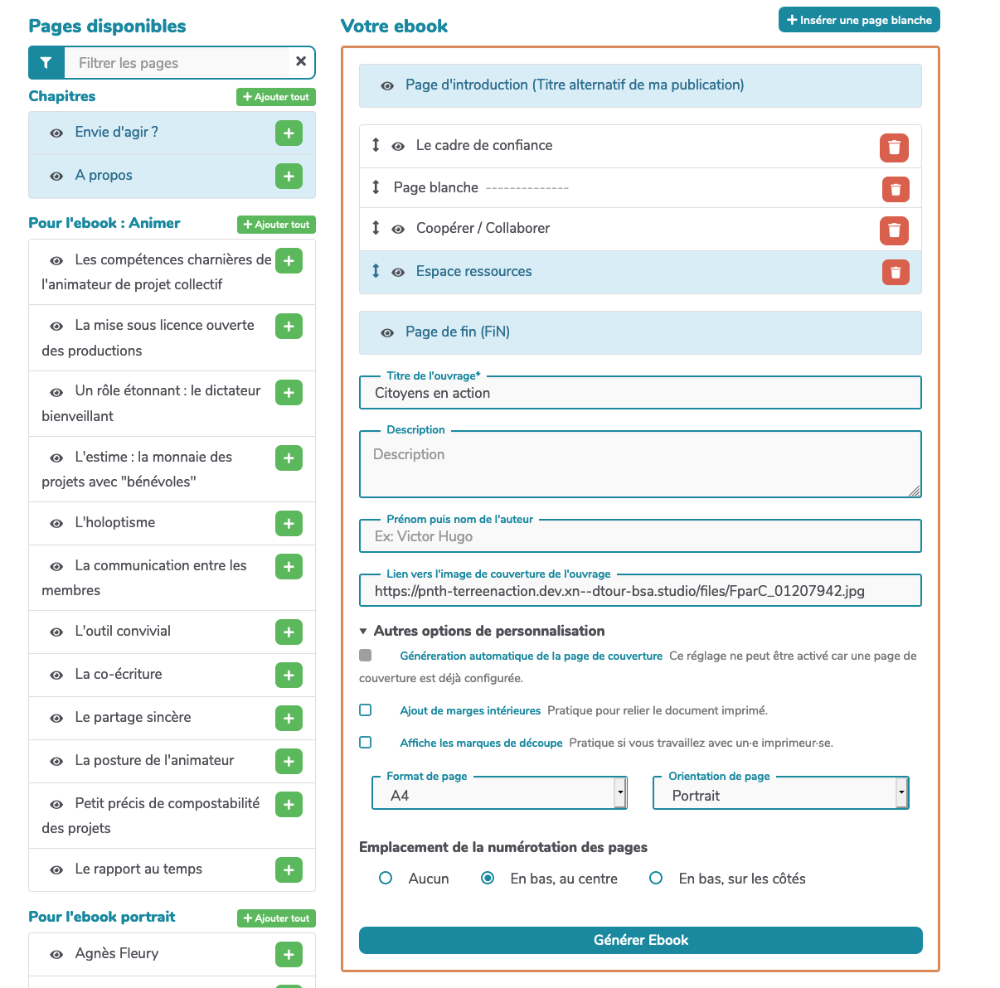
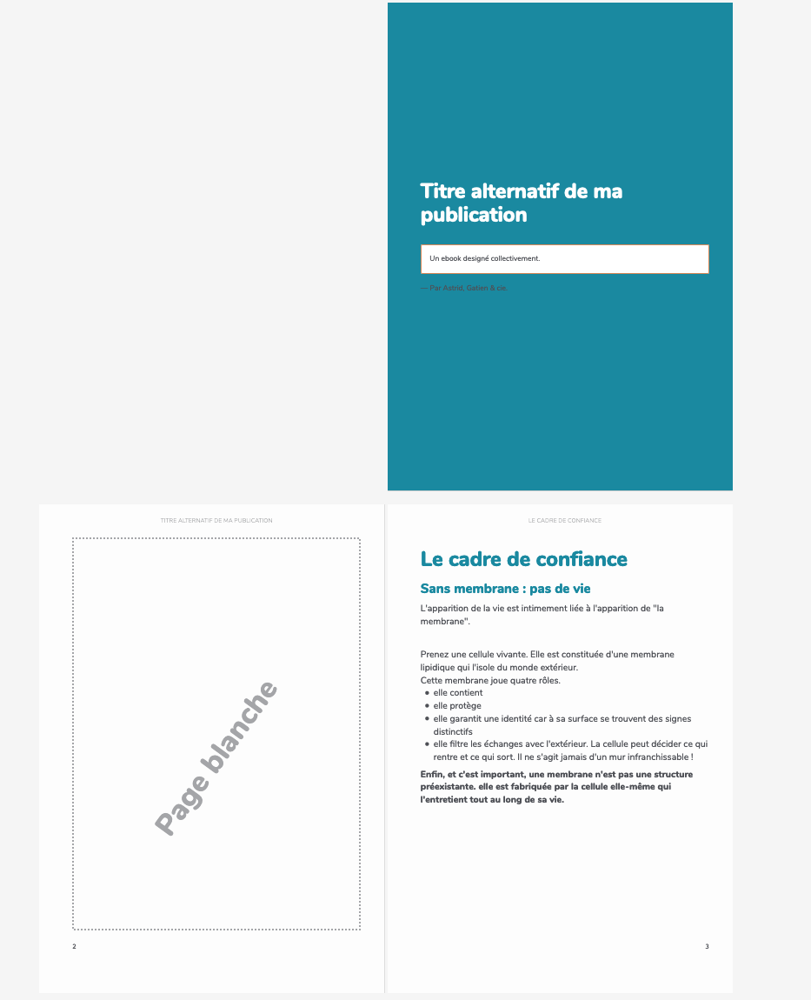
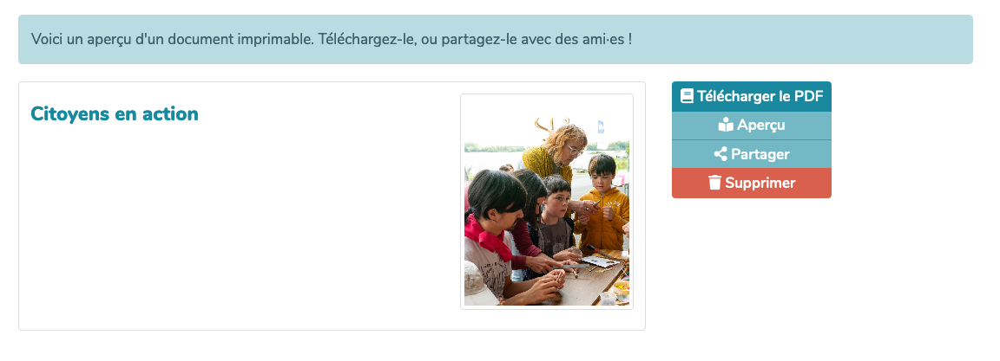
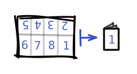

# Extension YesWiki publication

 - [English](#english)
 - [Français](#extension-yesWiki-publication)

----

Une extension [YesWiki] pour créer des documents imprimables (format PDF) à partir d'une sélection de [fiches Bazar][Bazar] et/ou de [pages de contenu][yeswiki-page].

----

> **Cette page est une documentation technique**. L'aide à l'usage est sur la page `/doc` de votre wiki une fois l'extension activée, et ici : https://github.com/YesWiki/yeswiki-extension-publication/blob/ectoplasme/docs/fr/README.md


## Introduction 

La mise en page est effectuée par [Paged.js](https://www.pagedjs.org/)
([documentation](https://www.pagedjs.org/documentation/)), et la capture PDF par un [navigateur dit "headless"][headless-browser] (par défaut [chromium](#pré-requis)).

Les publications générées sont de type [livres/livrets](#pour-générer-des-livrets-téléchargeables), [fanzines](#pour-générer-des-livrets-téléchargeables) ou [newsletter](#pour-générer-des-newsletters).

<table>
  <tr>
    <td>
      
    </td>
    <td>
      
    </td>
  </tr>
  <tr>
    <th scope="col">Assemblage de pages (<a href="#action-publicationgenerator">action <code>{{publicationgenerator}}</code></a>)</th>
    <th scope="col">Publication PDF qui reprend les styles du wiki</th>
  </tr>
  <tr>
    <td>
      
    </td>
    <td>
      
    </td>
  </tr>
  <tr>
    <th scope="col">Une page "publication", avec actions de téléchargement et prévisualisation (auteur·ices et admin)</th>
    <th scope="col">Bouton d'export à ajouter (<a href="#action-entries2publication">action <code>{{entries2publication}}</code></a>)</th>
  </tr>
  <tr>
    <td>
      
    </td>
    <td>
    </td>
  </tr>
  <tr>
    <th scope="col">Exemple de pliage de fanzine</th>
    <th scope="col"></th>
  </tr>
</table>

## Installation

Sur l'écran `/admin/updates` de votre wiki, installez l'extension `publication` : l'installer l'active. En ligne de commande : `./yeswicli extension:enable publication`. La version `5.x` est pour YesWiki Ectoplasme, la `4.x` pour Doryphore.

À la mise à jour depuis Doryphore, deux migrations de l'extension réécrivent `{{entries2publication` en `{{entries2publication` dans la version courante des pages, et recopient dans les métadonnées des pages les options de publication que Doryphore gardait ailleurs.

## Pré-requis technique

Avoir installé [Chromium](https://www.chromium.org/Home) **sur
le serveur**. L'extension utilise le programme indiqué par `htmltopdf_path` (`/usr/bin/chromium` par défaut) ; s'il n'y est pas, elle cherche `chromium`, `chromium-browser`, `google-chrome` ou `chrome` dans le `PATH` du serveur.

Pour installer Chrome sous Ubuntu/Debian :

```bash
sudo apt install -y --no-install-recommends chromium
```

## Fonctionnement général

La génération d'une publication se fait en plusieurs étapes.

1. Sélection des éléments constitutifs de la publication.
2. Organisation des éléments constitutifs au sein de la publication.
3. Génération et enregistrement de la publication.
4. Production du PDF.

L'action `{{publicationgenerator}}` prend en charge les étapes 1, 2 et 3.

Le handler `/pdf` prend en charge l'étape 4. Le PDF d'une personne non connectée est gardé dans `cache/publication/` pour la suivante ; celui d'une personne connectée n'est jamais gardé.

### Pour générer des livrets téléchargeables

Utiliser l'action `{{publicationgenerator}}`. Aucun paramètre n'est obligatoire.

Chaque publication est générée sous forme d'une page wiki. Le nom de cette page est fait du paramètre `pagenameprefix` (par défaut `Ebook`) suivi du titre, en minuscules et séparés par des tirets : `ebook-mon-livre`.

On pourra utilement consulter la section [Action `{{publicationgenerator}}`](#action-publicationgenerator) ci-après.

### Pour générer des newsletters

Avant de pouvoir générer des newsletters, il faut créer un formulaire bazar suivant avec la structure suivante :

```
texte***bf_titre***Titre***60***255*** *** *** ***1***0***
texte***bf_description***Description***60***255*** *** *** ***0***0***
texte***bf_author***Auteur***60***255*** *** *** ***0***0***
textelong***bf_content***Contenu de la newsletter***20***20*** *** ***html***1***0***
```

Un fois ce formulaire créé, il faut trouver son id et utiliser l'action `{{publicationgenerator}}` avec, au minimum les paramètres suivants :

- `outputformat="newsletter"`
- `formid="<id du formulaire>"`

Soit, au minimum : `{{publicationgenerator outputformat="newsletter" formid="<id du formulaire>"}}`

Chaque newsletter générée sera enregistrée sous la forme d'une fiche bazar du formulaire \<id du formulaire> sur le wiki.

On pourra utilement consulter la section [Action `{{publicationgenerator}}`](#action-publicationgenerator) ci-après.

## Actions YesWiki

L'extension publication ajoute ces actions à votre wiki.

| Action                    | Utilité                                       |
| ---                       | ---                                           |
| `{{publicationgenerator}}`| Interface de sélection du contenu de la publication et de création du document imprimable (cf. [Action `{{publicationgenerator}}`](#action-publicationgenerator)) |
| `{{publicationlist}}`           | Liste des ebooks générés et imprimables (cf. [Action `{{publicationlist}}`](#action-publicationlist)) |
| `{{entries2publication}}` | Exporte en PDF les fiches de la liste de la page (anciennement `{{bazar2publication}}`, qui fonctionne toujours) (cf. [Action `{{entries2publication}}`](#action-entries2publication)) |
| `{{blankpage}}`           | Insère une page vide à l'impression. |
| `{{pagebreak}}`           | Crée un saut de page à l'impression. |
| `{{listcontrib field="bf_nom"}}` | Liste les noms portés par ce champ dans les fiches qu'une publication inclut. |
| `{{publication-template}}`| Combiné avec `{{entries2publication templatepage="…"}}`, signale l'emplacement réservé à l'injection de contenus. |

Ces actions s'ajoutent, comme toute action YesWiki, dans un contenu de page, ou depuis la palette de composants de l'éditeur (pour les admins).

### Action `{{publicationgenerator}}`

Cette action affiche une interface permettant de

- sélectionner, parmi les fiches bazar et pages YesWiki, les éléments constituant la publication ;
- organiser ces différents éléments au sein de la publication ;
- créer le document imprimable résultant.

Les différents paramètres de cette action sont les suivants.

*N.B* — Dans les explications qui suivent, le terme "sélection" désigne la sélection des éléments constitutifs d'une publication.

#### **groupselector**

*S'il est utilisé, ce paramètre doit l'être conjointement au paramètre `titles`.*

Liste des groupes d'éléments proposés à la sélection.

Dans la liste,

- les groupes doivent être séparés par des virgules ;
- les pages YesWiki seront identifiées par le mot "pages" ;
  pour une page YesWiki, on peut préciser, entre parenthèses et après "pages",
  - une liste de mots clefs associés à ces pages,
  - les critères doivent être séparés par des "|" ;
- un formulaire bazar est identifié par son numéro identifiant (exemple : "1"),
  pour un formulaire, on peut préciser, entre parenthèses et après son numéro,
  - une liste de critères de sélection dans ce formulaire,
  - les critères doivent être séparés par des "|".

Exemple – les éléments suivants
- Les pages wiki "pages wiki", reprenant les pages du wiki ;
```
{{publicationgenerator titles="pages wiki" groupselector="pages"}}
```
- Les pages wiki taggées "important", reprenant les pages du wiki catégorisées (au moyen d'un mot-clef) comme importantes ;
```
{{publicationgenerator titles="important" groupselector="pages(important)"}}
```
- Les fiches associées à un formulaire "recettes de cuisine", reprenant les fiches du formulaire 1 ;
```
{{publicationgenerator titles="recettes de cuisine" groupselector="1"}}
```
- Certaines fiches "livres", reprenant les fiches du formulaire 2 dont l'auteur est "Rabelais" ou dont la taille est "long" ;
```
{{publicationgenerator titles="livres" groupselector="2(bf_auteur=Rabelais|bf_taille=long)"}}
```

```
{{publicationgenerator titles="pages wiki, important, recettes de cuisine, livres" groupselector="pages, pages(important), 1, 2(bf_auteur=Rabelais|bf_taille=long)"}}
```

Exemple – Pour organiser les éléments proposés dans quatre groupes différents,
- un groupe, nommé "pages wiki", reprenant les pages du wiki ;
- un groupe, nommé "important", reprenant les pages du wiki catégorisées (au moyen d'un mot-clef) comme importantes ;
- un groupe, nommé "recettes de cuisine", reprenant les fiches du formulaire 1 ;
- un groupe, nommé "livres", reprenant les fiches du formulaire 2 dont l'auteur est "Rabelais" ou dont la taille est "long" ;

```
{{publicationgenerator titles="pages wiki, important, recettes de cuisine, livres" groupselector="pages, pages(important), 1, 2(bf_auteur=Rabelais|bf_taille=long)"}}
```

#### **title**

Titre des publications à générer.

Si ce paramètre est renseigné, le titre de la publication sera celui qu'il donne. Et l'utilisateur ne se verra pas proposer de choix lors de la sélection.

Si ce paramètre n'est pas renseigné ou est vide, l'utilisateur pourra, lors de la sélection, saisir un titre.

Exemple  :

```
{{publicationgenerator title="Guerre et paix"}}
```

#### **outputformat**

Détermine le type de publication générée (ebook ou newsletter).

S'il n'est pas précisé, ce paramètre vaut "ebook".

Exemple – pour générer une newsletter il faut donc écrire :

```
{{publicationgenerator outputformat="newsletter"}}
```

#### **formid**

*Paramètre spécifique et obligatoire dans le cas où on souhaite générer une newsletter.*

Lorsqu'une newsletter est générée, elle est enregistrée sous forme d'une fiche bazar (voir à cet effet la section "Pour générer des newsletters"). Ce paramètre permet de spécifier le numéro identifiant du formulaire bazar en question.

Exemple – pour générer une newsletter avec le formulaire bazar "2", il faut donc écrire :

```
{{publicationgenerator outputformat="newsletter" formid="2"}}
```

#### **pagestart**

Nom de la page à utiliser comme page d'introduction de la publication.

Exemple :

```
{{publicationgenerator pagestart="MaPageWiki"}}
```

#### **pageend**

Nom de la page à utiliser comme page de fin de la publication.

Exemple :

```
{{publicationgenerator pageend="MaPageWiki"}}
```

#### **pagenameprefix**

*Paramètre utilisé uniquement dans le cas d'un ebook.*

Lorsqu'un ebook est généré, il est enregistré sous forme d'une page YesWiki (voir à cet effet la section "Pour générer des ebooks"). Ce paramètre permet de spécifier le préfixe automatiquement ajouté en début du nom de la page ainsi créée.

S'il n'est pas précisé, ce paramètre vaut "Ebook".

Exemple – pour générer un ebook avec le préfixe "MesEDoc", il faut donc écrire :

```
{{publicationgenerator outputformat="ebook" pagenameprefix="MesEDoc"}}
```


#### **coverimage**

*Paramètre utilisé uniquement dans le cas d'un ebook.*

Ce paramètre contient l'adresse de l'image de couverture utilisée en 1re page de couverture des ebooks générés.

Si ce paramètre n'est pas renseigné ou est vide, l'utilisateur pourra, lors de la sélection en vue d'un ebook, choisir une image de couverture.

Exemple  :

```
{{publicationgenerator outputformat="ebook" coverimage="monImage.jpg"}}
```

#### **title**

Titre par défaut des publications à générer.

Exemple  :

```
{{publicationgenerator title="Guerre et paix"}}
```

#### **desc**

Description par défaut des publications à générer.

Exemple  :

```
{{publicationgenerator desc="Les nouveautés du mois dernier"}}
```

#### **author**

Auteur·ices par défaut des publications à générer.

Exemple  :

```
{{publicationgenerator author="George Sand"}}
```

#### **chapterpages**

Liste des noms des pages YesWiki à utiliser comme chapitre des publications à générer.

Dans la liste, les noms doivent être séparés par des virgules.

Si ce paramètre est renseigné, les pages ainsi désignées seront proposées par défaut dans la publication lors de la sélection.

L'utilisateur pourra, lors de la sélection, choisir les pages qu'il souhaite mettre à la suite de chaque chapitre.

Exemple  :

```
{{publicationgenerator chapterpages="DebutChapitreUn, DebutChapitreDeux, DebutChapitreTrois"}}
```

#### **readonly**

Spécifie si les titre, description, auteur·ices, image et chapitres sont modifiables par l'utilisateur.

Les paramètres d'impression restent modifiables dans tous les cas.

Exemple :

```
{{publicationgenerator readonly}}
```

### Action `{{publicationlist}}`

Cette action liste les ebook générés.

#### **pagenameprefix**

Le paramètre `pagenameprefix` précise le préfixe par lequel commencent les noms de pages correspondant à des ebooks.

S'il n'est pas précisé, ce paramètre vaut "Ebook".

Exemple – Pour lister les ebooks dont le préfixe est "MesEDoc", il faut donc écrire :

```
{{publicationlist outputformat="ebook" pagenameprefix="MesEDoc"}}
```

### Action `{{entries2publication}}`

Cette action affiche un bouton qui imprime les fiches de la première liste (`{{entrylist}}`) de la page, en tenant compte des facettes que la lectrice a cochées. La mise en page s'ouvre et le navigateur propose l'impression une fois la page composée.
Il n'y a pas d'étape de personnalisation.

L'action s'appelait `{{bazar2publication}}` : ce nom fonctionne toujours.

Tous les paramètres sont facultatifs.

#### **title**

Personnalise le texte affiché sur le bouton.

```
{{entries2publication title="Imprimer ces résultats"}}
```

#### **icon**

_Par défaut_ : `printer`.

Personnalise l'icône affichée : un nom d'icône du jeu d'icônes de YesWiki (les anciens noms Font Awesome comme `fa-book` sont convertis).

```
{{entries2publication icon="download"}}
```

#### **templatepage**

Par défaut, chaque fiche Bazar démarre sur une nouvelle page.

Cet attribut importe les options de publication d'une page Ebook, celles saisies dans le formulaire de création (format, orientation, couverture…).

```
{{entries2publication templatepage="EbookModelePourBazar"}}
```

Un Ebook modèle se crée comme tout autre publication, à partir d'une [action `{{publicationgenerator}}`](#action-publicationgenerator).

Par défaut, le _contenu_ de la page modèle est remplacé par les fiches Bazar.
L'utilisation de l'action [`{{publication-template}}`](#action-publication-template) dans la page modèle vous donne la liberté de choisir l'emplacement où les fiches Bazar seront insérées.

### Action `{{publication-template}}`

Cette action se place dans une page Ebook dont vous voulez vous servir comme modèle de publication.

Ce modèle de publication s'utilise notamment pour personnaliser un export depuis une liste Bazar à l'aide du [bouton généré par l'action `{{entries2publication}}`](#action-entries2publication).

```
{{include page="EbookPageIntro" class="publication-cover"}}
{{include page="EbookRemerciements"}}
<mark>{{publication-template}}</mark>
{{include page="EbookPageFin" class="publication-end"}}
```

## Handlers (ou suffixes) de page

L'extension publication ajoute trois handlers aux pages de votre wiki.

| handler       | Utilité                        |
| ---           | ---                            |
| `/pdf`        | Télécharge un document en PDF  |
| `/preview`    | Prévisualise un document |
| `/pdfiframe`  | `/pdf` dans une iframe (à autoriser dans `allowed_methods_in_iframe`) |

Une page publication affiche sous son contenu une carte avec les boutons de téléchargement et d'aperçu. Les autres pages affichent un bouton PDF sous leur contenu pour les personnes connectées ou ayant le droit d'écrire.

## Adapter templates et contenus

### Vous souhaitez escamoter certaines parties de vos pages wiki lors de l'édition du pdf

à priori, deux class permettent de cacher des parties du votre wiki :
 - `""<div class="no-print"> ""bla bla à supprimer à l'impression""</div>"" `
 - `""<div class="hide-print"> ""bla bla à supprimer à l'impression""</div>"" `

### Imprimer une page qui n'est pas une publication

`?MaPage/pdf` sur une page ou une fiche qui ne porte pas d'options de publication
utilise une disposition à part, `page`, au lieu de celle des livres :

- des marges de 10 mm au lieu des 20 à 40 mm réservés à la reliure, soit 190 mm de
  largeur utile sur A4 au lieu de 140 mm ;
- pas de titre courant, pas de démarrage forcé sur une belle page, pas de saut de
  page avant chaque `h1` ;
- les colonnes restent côte à côte.

Les colonnes tiennent parce que la disposition `page` ne charge pas `book.css`, qui
les annule volontairement pour garder une justification lisible sur la
colonne étroite d'un livre. Les largeurs viennent des `@media (min-width: …)`,
évaluées contre la fenêtre de rendu (`windowSize` dans
`htmltopdf_options`, 1920 px par défaut).

#### Les cartes Leaflet

Elles sortaient en aplat gris. Deux choses s'y opposaient.

Leaflet cache ses tuiles par défaut, `.leaflet-tile { visibility: hidden }`, et ne
les révèle qu'en posant `leaflet-tile-loaded` depuis son code, sur les balises
qu'il a créées lui-même. Paged.js recopie la carte dans la page, et les copies
n'obtiennent jamais cette classe.

Leaflet fait aussi apparaître chaque tuile en fondu, en animant une opacité posée
en style en ligne. La copie fige ce fondu où il en était, souvent près de zéro.
`page.css` remet les deux à plat, avec un `!important` pour le second puisque rien
d'autre ne passe devant un style en ligne.

Leaflet cadre ensuite sa vue sur la largeur de son conteneur au moment où il
démarre, soit la fenêtre du navigateur, 1855 px ici. Paged.js rogne ensuite cette
vue aux 653 px de la page, et le sujet de la carte sortait du cadre, à 869 px du
bord. `page.css` déclare la largeur imprimée dans `--publication-measure`, et
`print.js` met le contenu à cette largeur avant de paginer, ce qui donne à Leaflet
la bonne mesure. Les livres et les fanzines ne déclarent pas cette variable et ne
changent donc pas de comportement.

Les commandes de zoom et de navigation sont masquées, l'attribution reste : c'est
la licence des tuiles.

### Pourquoi Paged.js reste en 0.3.5

La 0.4 plante sur toute requête média que son analyseur ne sait pas lire. Son
gestionnaire `PrintMedia` appelle `.includes()` sur le retour de `getMediaName()`,
qui vaut `undefined` dès que css-tree n'a pas su analyser le prélude. Or css-tree
1.1.3, la version qu'embarque Paged.js, ne connaît pas la syntaxe d'intervalle du
niveau 4, `@media (width <= 801px)`, que le `yeswiki-base.css` du cœur et plusieurs
thèmes utilisent. L'exception remonte jusqu'à `preview()`, aucune page n'est
composée, et le PDF sort blanc.

La 0.4 supprime aussi tous les blocs `@media` autres que `print` et `all`, ce qui
met chaque colonne sur sa propre ligne. La 0.3.5 les conserve.

### Surcharger les styles d'impression par défaut

Des styles d'impression par défaut sont ajoutés pour vous donner le moins de travail possible lors de la création d'une publication.
Il y a plusieurs mécanismes pour **personnaliser vos styles d'impression** en créant des feuilles de styles (fichiers `.css`) :

| Répertoire                                                  | Noms possibles            | À quoi ça s'applique ?
| ---                                                         | ---                       | ---
| `custom/publication/*.css`                                  | Peu importe               | Toute publication
| `custom/publication/print-layouts/*.css`                    | `fanzine.css`, `book.css`, `page.css` | Seulement les fanzines, les livres/livrets, ou les pages simples

Le gabarit de la mise en page se surcharge en copiant `templates/print-layouts/base.twig` dans `custom/templates/publication/print-layouts/base.twig`.

## Configuration serveur (`yeswiki.config.php`)

**Remarque** : les réglages principaux sont exposés sur l'écran `/admin/config`.

Le fichier de configuration `yeswiki.config.php` accepte
plusieurs paramètres pour ajuster le rendu PDF à votre infrastructure informatique.

| Clé de configuration                   | Valeur par défaut                  | Utilité
| ---                                    | ---                                | ---
| `htmltopdf_path`                       | `/usr/bin/chromium`                | Indique l'emplacement du programme chargé
| `htmltopdf_options`                    | `['windowSize' => [1920, 1080], 'noSandbox' => true, …]`  | Options par défaut passées au navigateur embarqué
| `htmltopdf_service_url`                |                                    | Adresse du serveur YesWiki qui fera le rendu à distance
| `htmltopdf_service_authorized_domains` |                                    | Si votre serveur partage les fonction de générateur de pdf, il faut lui indique les nom de domaines autorisés
| `htmltopdf_base_url` |                 | Si votre serveur n'a pas accès au wiki via la valeur de `base_url`
| `page_load_timeout`                    | `60000`                            | Temps laissé au navigateur, en millisecondes, pour charger la page et terminer sa mise en page

### … avec Chrome sur votre serveur

```php
array(
    ...
    'htmltopdf_path' => '/usr/bin/chrome',
    'htmltopdf_options' => ['windowSize' => [1440, 780], 'noSandbox' => true],
    ...
);
```

### Vous avez un YesWiki qui est autorisé à utiliser le service pdf de https://example.org/yeswiki

```php
array(
    ...
    'htmltopdf_service_url' => 'https://example.org/yeswiki/?PagePrincipale/pdf',
    ...
);
```

### Vous avez un YesWiki qui est un service pdf pour d'autres wikis

Vous devez indiquer les noms de domaine que vous autorisez :

```php
array(
    ...
    'htmltopdf_service_authorized_domains' => ['example.org', 'youpi.com', 'toto.fr'],
    ...
);
```

### Si la génération s'arrête sur une erreur 504

Le serveur web coupe la requête au bout d'un certain temps (`fastcgi_read_timeout`
chez nginx, `ProxyTimeout` ou `Timeout` chez Apache), souvent 60 secondes. PHP, lui,
continue de travailler dans le vide et la personne ne reçoit qu'une page d'erreur du
serveur web, sans message de l'extension.

La génération prend au plus `page_load_timeout` plus 30 secondes pour le rendu du PDF.
Gardez donc `page_load_timeout` sous le délai de votre serveur web, ou allongez ce
dernier.

```php
array(
    ...
    // 25 s de chargement + 30 s de rendu, sous une coupure à 60 s
    'page_load_timeout' => 25000,
    ...
);
```

### Avec Docker / reverse-proxy

⚠️ **Utilisation avancée**

La génération de PDF va échouer sur un environnement technique où YesWiki _et_ Chromium sont dans un conteneur Docker — ou un reverse-proxy — qui n'a pas accès au réseau externe, c'est-à-dire au wiki via l'URL configurée dans `base_url` du `yeswiki.config.php`.

`htmltopdf_base_url` sera utilisée comme substitut pour accéder aus contenus du wiki (pages, images, vidéos, etc.).

```php
// docker run -p 8000:80 …
array(
    // URL exposée par le conteneur Docker (extérieur)
    'base_url' => 'https://example.com:8000/?,
    ...
    // URL à l'intérieur du conteneur Docker (port interne)
    'htmltopdf_base_url' => 'http://localhost:80/?',
);
```

## English

A [YesWiki] extension to create printable documents (PDF format) from a selection of [Bazar entries][Bazar] and/or [content pages][yeswiki-page].

----

> **This page is a technical documentation**. Usage help is on your wiki's `/doc` page once the extension is on, and here: https://github.com/YesWiki/yeswiki-extension-publication/blob/ectoplasme/docs/en/README.md

### Introduction 

Pagination is done by [Paged.js](https://www.pagedjs.org/)
([documentation](https://www.pagedjs.org/documentation/)), and PDF print by a ["headless" browser][headless-browser] by default [chromium](#pré-requis-techniques)).

Generated publications are of type [books/booklets](#pour-générer-des-livrets-téléchargeables '(french)'), [fanzines](#pour-générer-des-livrets-téléchargeables '(french)') or [newsletter](#pour-générer-des-newsletters '(french)').

### Install

On your wiki's `/admin/updates` screen, install the `publication` extension: installing it switches it on. From a shell: `./yeswicli extension:enable publication`. Version `5.x` is for YesWiki Ectoplasme, `4.x` for Doryphore.

Chromium has to be installed on the server: the extension runs the program `htmltopdf_path` names (`/usr/bin/chromium` by default), or else the first `chromium`, `chromium-browser`, `google-chrome` or `chrome` on the server's `PATH`.

The `{{bazar2publication}}` action is now `{{entries2publication}}`; the old name keeps working, and a migration rewrites it in the current revision of every page.

See the [usage documentation](docs/en/README.md).

[YesWiki]: https://yeswiki.net/
[Bazar]: https://yeswiki.net/?doc#/docs/users/fr/bazar
[yeswiki-page]: https://yeswiki.net/?doc#/docs/users/fr/prise-en-main
[headless-browser]: https://developers.google.com/web/updates/2017/04/headless-chrome